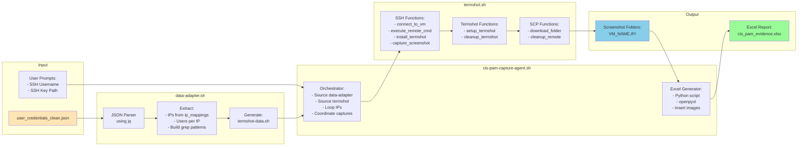
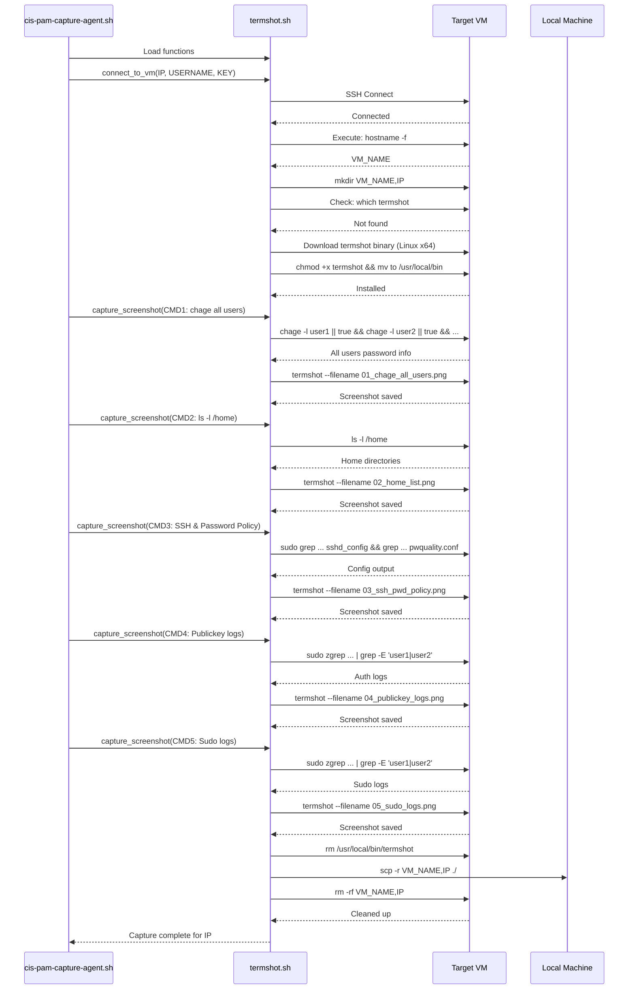

# USECASE: Capturing Image on Linux Headless

## Description
This SPEC.md file provides comprehensive guidance for implement new usecases


## Prerequiste 
1. termshot https://github.com/homeport/termshot

## Project Structure for OpenAI Codex Navigation

- `/usecase`: Folder kepts usecase instruction
  - `/extract-clean-users-creds-v3.sh`: scripts that will generate process data (output will be smiilar on user_credentials_clean.json) which will be used on pam-agent-v4.sh
  - `/user_credentials_clean.json`: example data for using with pam-agent-v4.sh
  - `/pam-agent-v4.sh`: core usecase and entry-point for running script, all logic will includes in here.

## Objective

capturing image with termshot https://github.com/homeport/termshot from command on linux headless (focusing on ubuntu)

## Task
1. capturing image with termshot with command that had given following
 - `chage -l {{ username }}`
 - `ls -l /home`
 - `sudo grep -E "PermitRootLogin|PasswordAuthentication|PermitEmptyPasswords|X11Forwarding|UseDNS|UsePAM|PrintMotd" /etc/ssh/sshd_config && grep -E "minlen|dcredit|ucredit|lcredit|ocredit|enforcing" /etc/security/pwquality.conf`
 - `sudo grep 'Accepted publickey' /var/log/auth.log | awk '!seen[$9]++'`
 - `sudo grep 'sudo:session' /var/log/auth.log | grep 'root(uid=0) by' | awk '{split($NF, a, "("); if (!seen[a[1]]++) print}'`

Task Description (execp)
 - `chage -l {{ username }}` -> validate every {{ username }} from `user_credentials_clean.json`.
    Key of validate -> if user exists -> PASSED
 - `ls -l /home` -> Shows users on /home
    Key of validate -> all users exists based on `user_credentials_clean.json`. -> PASSED
 - `sudo grep -E "PermitRootLogin|PasswordAuthentication|PermitEmptyPasswords|X11Forwarding|UseDNS|UsePAM|PrintMotd" /etc/ssh/sshd_config && grep -E "minlen|dcredit|ucredit|lcredit|ocredit|enforcing" /etc/security/pwquality.conf`
    Key of validate -> Output should be simmlar like this -> PASSED
    
```bash
PermitRootLogin no
PasswordAuthentication no
PermitEmptyPasswords no
UsePAM yes
X11Forwarding no
PrintMotd no
UseDNS no
minlen = 14
dcredit = -1
ucredit = -1
lcredit = -1
ocredit = -1
enforcing = 1
```
 - `sudo zgrep -h 'Accepted publickey' /var/log/auth.log*  | sed 's/RSA SHA256:[^ ]*/RSA/' | sed 's/ED25519 SHA256:[^ ]*/ED25519/' | awk '!seen[$7]++' | grep -E '{{ username_1 }}|{{ username_.. }}'` -> grep every {{ username }} from `user_credentials_clean.json` 
    Key of validating -> All usernames succeed auth with publickey, -> PASSED. usernames refers on `user_credentials_clean.json`

 - `sudo zgrep 'sudo:session' /var/log/auth.log* | grep 'root(uid=0) by' | awk '{split($NF, a, "("); if (!seen[a[1]]++) print}' | grep -E '{{ username_1 }}|{{ username_.. }}`
    Key of validating -> All usernames succeed on accessing root privileged, -> PASSED. username refers on `user_credentials_clean.json`

## Requirement
Create 3 bash script files includes, both scripts can be used as isolated (can be run via curl execution)
1. `termshot.sh` "utils isolated script" for automated capturing images from command, focusing on capturing image via termshot
   1.1 have SSH management (also support parameters for specific private key) that can control how many target VMs for capture images
   1.2 inputs must have following
    - VMs string lists (username@ip)
    - CLIs lists for capturing images

2. `data-adapter.sh` script for converting `user_credentials_clean.json` into data that can be adapting into input variables in `termshot.sh` (convert it in bash variables for termshot.sh can be source from it)

3. `cis-pam-capture-agent.sh` Core script for complete the TASK by integrated with `termshot.sh` and `data-adapter.sh` this script focusing automation capturing PAM evidences from given TASK

## Relative Data
- This usecase will be must have `user_credentials_clean.json` data input

## Workflow/Implement Steps
1. in `pam-agent-v4.sh` there will have new options called `ตรวจสอบความถูกต้องตามมาตรฐาน CIS` and `แคปหลักฐานตามมาตรฐาน CIS`
1. User must have `user_credentials_clean.json` as prerequisite 
2. Executed `data-adapter.sh` for processed  `user_credentials_clean.json` into shell script variables (named it `termshot-data.sh`) that can be source for `termshot.sh` can be used
3. Executed `cis-pam-capture-agent.sh` this will 
   3.1 source `termshot-data.sh`
   3.2 source `termshot.sh`
   3.3 script will controlling `termshort.sh` based on data that it had been source from `termshot-data.sh`
    - `termshot.sh` will loop ssh into target VMs server then create folder for storing snapshot. label folder name with "{VM_NAME},{PRIVATE_IP}"
    - then it starting to capturing from the CLIs list that we had provided. label each images with index run-number
    - when it each SSH sessions had done. scp folder into local machine
    - when loop process for capturing image completed. `cis-pam-capture-agent.sh` will generate excel files from data `user_credentials_clean.json` execl columns template will looks like this
```csv
VM Name,OS,Private IP,Public IP,Password policy (Expired),List users,Permit root login,Log Login ด้วย Private Key,Log sudo su,Remark
```
    - Then put data on this files which it will be includes what we have -> VM NAme, Private IP (you can extracted this data from folder name that had formula "{VM_NAME},{PRIVATE_IP}") and Password policy (Expired),List users,Permit root login,Log Login ด้วย Private Key,Log sudo su
    - till "Password policy (Expired)" left to right, put images that label as index run number
    - loop process until it put all IP
    - end process

## Diagram

### TASK-1 : Implementation Workflow Diagram

```mermaid
flowchart TD
    Start([User runs cis-pam-capture-agent.sh]) --> CheckPrereq[Check Prerequisites]
    CheckPrereq --> HasJSON{user_credentials_clean.json exists?}
    HasJSON -->|No| ErrorJSON[Error: JSON file not found]
    HasJSON -->|Yes| PromptUser[Prompt for SSH username]
    
    PromptUser --> PromptKey{SSH key path provided?}
    PromptKey -->|Yes| SetKey[Set SSH_KEY_PATH]
    PromptKey -->|No| SkipKey[Use default SSH auth]
    
    SetKey --> RunDataAdapter[Execute data-adapter.sh]
    SkipKey --> RunDataAdapter
    
    RunDataAdapter --> ParseJSON[Parse user_credentials_clean.json]
    ParseJSON --> ExtractIPs[Extract unique IPs from ip_mappings]
    ExtractIPs --> BuildUserArrays[Build username arrays per IP]
    BuildUserArrays --> GeneratePatterns[Generate grep patterns for users]
    GeneratePatterns --> ExportVars[Export bash variables to termshot-data.sh]
    
    ExportVars --> SourceData[Source termshot-data.sh]
    SourceData --> SourceTermshot[Source termshot.sh functions]
    
    SourceTermshot --> LoopIPs{For each IP in list}
    LoopIPs -->|Next IP| SSHConnect[SSH to target VM]
    
    SSHConnect --> GetHostname[Execute: hostname -f to get VM_NAME]
    GetHostname --> CreateFolder[Create folder: {VM_NAME},{PRIVATE_IP}]
    CreateFolder --> CheckTermshot{termshot installed?}
    
    CheckTermshot -->|No| InstallTermshot[Download & install termshot binary]
    CheckTermshot -->|Yes| StartCapture
    InstallTermshot --> StartCapture[Start capturing screenshots]
    
    StartCapture --> Cmd1[CMD 1: chage -l user1 && chage -l user2 && ...]
    Cmd1 --> Capture1[termshot --filename 01_chage_all_users.png]
    Capture1 --> Cmd2[CMD 2: ls -l /home]
    Cmd2 --> Capture2[termshot --filename 02_home_list.png]
    Capture2 --> Cmd3[CMD 3: SSH Config & Password Policy]
    Cmd3 --> Capture3[termshot --filename 03_ssh_pwd_policy.png]
    Capture3 --> Cmd4[CMD 4: Publickey Auth Logs with user filter]
    Cmd4 --> Capture4[termshot --filename 04_publickey_logs.png]
    Capture4 --> Cmd5[CMD 5: Sudo Session Logs with user filter]
    Cmd5 --> Capture5[termshot --filename 05_sudo_logs.png]
    
    Capture5 --> UninstallTermshot[Uninstall termshot binary]
    
    UninstallTermshot --> SCPFolder[SCP folder to local machine]
    SCPFolder --> RemoteCleanup[Remove remote folder]
    RemoteCleanup --> MoreIPs{More IPs?}
    
    MoreIPs -->|Yes| LoopIPs
    MoreIPs -->|No| GenerateExcel[Generate Excel Report]
    
    GenerateExcel --> InitExcel[Initialize Python openpyxl]
    InitExcel --> CreateHeaders[Create CSV Headers]
    CreateHeaders --> LoopFolders{For each captured folder}
    
    LoopFolders -->|Next Folder| ParseFolderName[Extract VM_NAME & PRIVATE_IP from folder name]
    ParseFolderName --> AddRow[Add row to Excel]
    AddRow --> InsertImages[Insert images from folder into cells]
    InsertImages --> NextFolder{More folders?}
    
    NextFolder -->|Yes| LoopFolders
    NextFolder -->|No| SaveExcel[Save Excel file: cis_pam_evidence_{timestamp}.xlsx]
    
    SaveExcel --> CleanupLocal[Cleanup: Remove local screenshot folders]
    CleanupLocal --> Complete([Complete: Excel report generated])
    
    ErrorJSON --> End([Exit])
    Complete --> End
    
    style Start fill:#90EE90
    style Complete fill:#90EE90
    style ErrorJSON fill:#FFB6C1
    style GenerateExcel fill:#87CEEB
    style StartCapture fill:#FFD700
    style SSHConnect fill:#DDA0DD
```

### Data Flow Diagram



### Command Execution Sequence per VM



## Solution

### TASK-2 : Technical Implementation Details

#### 1. **data-adapter.sh** - JSON to Bash Variable Converter

**Purpose**: Parse `user_credentials_clean.json` and generate `termshot-data.sh` with bash arrays

**Key Features**:
- Use `jq` for JSON parsing
- Extract all unique IPs from `ip_mappings`
- Build associative arrays mapping IPs to usernames
- Generate grep patterns for log validation (e.g., `grep -E 'user1|user2|user3'`)
- Export variables that can be sourced by main script

**Generated Variables** (in termshot-data.sh):
```bash
# Array of all IPs to process
declare -a TARGET_IPS=("192.168.1.31" "192.168.1.32" ...)

# Associative array: IP -> space-separated usernames
declare -A IP_USERS
IP_USERS["192.168.1.31"]="chatchanon jurin"
IP_USERS["192.168.1.32"]="chatchanon jurin"

# Associative array: IP -> grep pattern for logs
declare -A IP_GREP_PATTERN
IP_GREP_PATTERN["192.168.1.31"]="chatchanon|jurin"

# Associative array: IP -> chage command chain
declare -A IP_CHAGE_CMD
IP_CHAGE_CMD["192.168.1.31"]="chage -l chatchanon || true && chage -l jurin || true"
```

**Implementation Approach**:
- Single-pass JSON parsing using `jq`
- Validate JSON structure before processing
- Error handling for missing fields
- Support for empty IP mappings

---

#### 2. **termshot.sh** - SSH and Screenshot Utility Functions

**Purpose**: Isolated utility script for SSH operations and termshot management

**Core Functions**:

##### a. `install_termshot_on_remote()`
- Detect OS architecture (x86_64, arm64)
- Download termshot binary from GitHub releases
- Install to `/usr/local/bin/termshot`
- Set executable permissions
- Verify installation with `termshot --version`

##### b. `uninstall_termshot_on_remote()`
- Remove termshot binary: `rm /usr/local/bin/termshot`
- Clean up any temporary files

##### c. `ssh_execute_cmd(ip, username, key_path, command)`
- Execute remote command via SSH
- Handle SSH key authentication
- Support for passwordless execution
- Return command output and exit code

##### d. `create_remote_folder(ip, vm_name)`
- Create folder with format: `{VM_NAME},{PRIVATE_IP}`
- Ensure unique folder names
- Handle existing folders

##### e. `capture_screenshot_remote(ip, command, output_filename)`
- Execute command on remote VM
- Pipe output to termshot
- Save screenshot with specified filename
- Handle long-running commands with timeout

##### f. `scp_folder_to_local(ip, remote_folder, local_dest)`
- Download entire folder from remote VM
- Preserve folder structure
- Progress indication for large transfers

##### g. `cleanup_remote_folder(ip, folder_path)`
- Remove temporary folder on remote VM
- Verify deletion

**SSH Connection Management**:
- Reuse SSH connections with ControlMaster
- Connection timeout: 10 seconds
- Retry logic for failed connections
- Proper SSH key permission validation

---

#### 3. **cis-pam-capture-agent.sh** - Main Orchestration Script

**Purpose**: Main entry point that coordinates entire capture workflow

**Workflow Steps**:

##### Phase 1: Initialization
1. Check for `user_credentials_clean.json`
2. Prompt user for SSH username (required)
3. Prompt for SSH key path (optional)
4. Execute `data-adapter.sh` to generate `termshot-data.sh`
5. Source `termshot-data.sh` (get arrays)
6. Source `termshot.sh` (get functions)

##### Phase 2: Capture Loop
For each IP in `TARGET_IPS`:
1. SSH connect to VM
2. Get VM hostname: `hostname -f` (FQDN)
3. Create folder: `{VM_NAME},{PRIVATE_IP}`
4. Install termshot binary
5. Execute capture commands in sequence:
   - **Command 1**: `chage -l user1 || true && chage -l user2 || true && ...` → `01_chage_all_users.png`
   - **Command 2**: `ls -l /home` → `02_home_list.png`
   - **Command 3**: SSH & Password config → `03_ssh_pwd_policy.png`
   - **Command 4**: Publickey auth logs (with user filter) → `04_publickey_logs.png`
   - **Command 5**: Sudo session logs (with user filter) → `05_sudo_logs.png`
6. Uninstall termshot
7. SCP folder to local machine
8. Remove remote folder
9. Simple progress: "Processing VM X of Y"

##### Phase 3: Excel Report Generation
1. Install Python dependencies if needed: `pip3 install openpyxl pillow`
2. Generate inline Python script using heredoc
3. Initialize Excel workbook with headers:
   ```
   VM Name | OS | Private IP | Public IP | Password policy (Expired) | List users | Permit root login | Log Login ด้วย Private Key | Log sudo su | Remark
   ```
4. For each captured folder:
   - Parse folder name to extract `VM_NAME` and `PRIVATE_IP`
   - Add row with VM information
   - Insert images into respective columns (E through I)
   - Auto-adjust row heights based on images
5. Save Excel file: `cis_pam_evidence_{timestamp}.xlsx`
6. Keep screenshot folders for manual inspection

**Python Excel Generation Logic** (Inline heredoc):
```python
from openpyxl import Workbook
from openpyxl.drawing.image import Image
from openpyxl.styles import Alignment, Font
import os
import glob
import sys

timestamp = sys.argv[1] if len(sys.argv) > 1 else "unknown"

wb = Workbook()
ws = wb.active
ws.title = "CIS PAM Evidence"

# Headers
headers = ["VM Name", "OS", "Private IP", "Public IP", 
           "Password policy (Expired)", "List users", 
           "Permit root login", "Log Login ด้วย Private Key", 
           "Log sudo su", "Remark"]
ws.append(headers)

# For each folder
folders = glob.glob("*,*")  # Pattern: {VM_NAME},{IP}
for folder in sorted(folders):
    parts = folder.split(",", 1)
    if len(parts) == 2:
        vm_name, private_ip = parts
    else:
        continue
    
    # Add row data
    row = [vm_name, "Ubuntu", private_ip, "", "", "", "", "", "", ""]
    ws.append(row)
    current_row = ws.max_row
    
    # Insert images in correct columns
    # Column E: Password policy (01_chage_all_users.png)
    # Column F: List users (02_home_list.png)
    # Column G: Permit root login (03_ssh_pwd_policy.png)
    # Column H: Log Login with Private Key (04_publickey_logs.png)
    # Column I: Log sudo su (05_sudo_logs.png)
    images = {
        "01_chage_all_users.png": "E",
        "02_home_list.png": "F",
        "03_ssh_pwd_policy.png": "G",
        "04_publickey_logs.png": "H",
        "05_sudo_logs.png": "I"
    }
    
    for img_file, col in images.items():
        img_path = os.path.join(folder, img_file)
        if os.path.exists(img_path):
            img = Image(img_path)
            img.width = 400
            img.height = 300
            ws.add_image(img, f"{col}{current_row}")
    
    # Set row height to accommodate images
    ws.row_dimensions[current_row].height = 225

# Save workbook
wb.save(f"cis_pam_evidence_{timestamp}.xlsx")
print(f"Excel report saved: cis_pam_evidence_{timestamp}.xlsx")
```

---

#### 4. **CIS Commands to Capture**

##### Command 1: Password Expiry for All Users (Chained)
```bash
chage -l user1 || true && chage -l user2 || true && chage -l user3 || true
```
**Purpose**: Check password expiration settings for all users in one screenshot
**Output**: `01_chage_all_users.png`
**Note**: Uses `|| true` to continue even if user doesn't exist
**Example**: `chage -l chatchanon || true && chage -l jurin || true`

##### Command 2: Home Directory Listing
```bash
ls -l /home
```
**Purpose**: Shows all user home directories
**Output**: `02_home_list.png`
**Validation**: All users from JSON should have home directories

##### Command 3: SSH Security & Password Policy
```bash
sudo grep -E "PermitRootLogin|PasswordAuthentication|PermitEmptyPasswords|X11Forwarding|UseDNS|UsePAM|PrintMotd" /etc/ssh/sshd_config && \
grep -E "minlen|dcredit|ucredit|lcredit|ocredit|enforcing" /etc/security/pwquality.conf
```
**Purpose**: Verify SSH hardening and password complexity rules
**Output**: `03_ssh_pwd_policy.png`
**Expected Output**:
```
PermitRootLogin no
PasswordAuthentication no
PermitEmptyPasswords no
UsePAM yes
X11Forwarding no
PrintMotd no
UseDNS no
minlen = 14
dcredit = -1
ucredit = -1
lcredit = -1
ocredit = -1
enforcing = 1
```

##### Command 4: Publickey Authentication Logs
```bash
sudo zgrep -h 'Accepted publickey' /var/log/auth.log* | \
sed 's/RSA SHA256:[^ ]*/RSA/' | \
sed 's/ED25519 SHA256:[^ ]*/ED25519/' | \
awk '!seen[$7]++' | \
grep -E 'chatchanon|jurin'
```
**Purpose**: Verify users successfully authenticated with SSH keys
**Output**: `04_publickey_logs.png`
**Note**: Grep pattern `chatchanon|jurin` generated dynamically from JSON per IP

##### Command 5: Sudo Access Logs
```bash
sudo zgrep 'sudo:session' /var/log/auth.log* | \
grep 'root(uid=0) by' | \
awk '{split($NF, a, "("); if (!seen[a[1]]++) print}' | \
grep -E 'chatchanon|jurin'
```
**Purpose**: Verify users have sudo privileges
**Output**: `05_sudo_logs.png`
**Note**: Grep pattern `chatchanon|jurin` generated dynamically from JSON per IP

---

#### 5. **Error Handling & Edge Cases**

**Handled Scenarios**:
- Missing JSON file → Exit with error
- Invalid JSON structure → Exit with error
- SSH connection failure → Skip IP, log error, continue
- termshot installation failure → Skip VM, log error
- Command execution timeout → Log warning, use empty screenshot
- SCP transfer failure → Retry 3 times, then skip
- Python/openpyxl not available → Install or exit with instructions
- Empty IP mappings → Warning, but continue
- Missing VM hostname → Use IP as VM_NAME

**Logging**:
- All operations logged to `cis_capture_{timestamp}.log`
- Progress indicators for long operations
- Color-coded terminal output (using existing PAM agent colors)

---

#### 6. **Installation & Dependencies**

**System Requirements**:
- `jq` - JSON processor (auto-installed if missing)
- `ssh` / `scp` - SSH client
- `python3` with `pip` (for Excel generation)
- `openpyxl` and `Pillow` Python packages

**Termshot Installation**:
- Download from: `https://github.com/homeport/termshot/releases/latest`
- Binary for Linux x64: `termshot_linux_amd64`
- Installation path: `/usr/local/bin/termshot`
- Cleanup after each VM

---

#### 7. **Integration with pam-agent-v4.sh**

**New Menu Options**:
```bash
9) 📸 ตรวจสอบความถูกต้องตามมาตรฐาน CIS (Validate CIS Compliance)
10) 📷 แคปหลักฐานตามมาตรฐาน CIS (Capture CIS Evidence)
```

**Option 9 Implementation** (Future):
- Interactive validation mode
- Execute commands and show real-time results
- Color-coded PASS/FAIL indicators

**Option 10 Implementation** (Current Focus):
- Execute `cis-pam-capture-agent.sh`
- Show progress for each VM
- Display final Excel report location

---

#### 8. **File Structure After Execution**

```
/pam-automation/
├── user_credentials_clean.json (input)
├── usecase/screenshot/
│   ├── data-adapter.sh (script)
│   ├── termshot.sh (script)
│   ├── cis-pam-capture-agent.sh (script)
│   ├── termshot-data.sh (generated, temporary)
│   ├── VM1,192.168.1.31/ (kept for inspection)
│   │   ├── 01_chage_all_users.png
│   │   ├── 02_home_list.png
│   │   ├── 03_ssh_pwd_policy.png
│   │   ├── 04_publickey_logs.png
│   │   └── 05_sudo_logs.png
│   ├── VM2,192.168.1.32/ (kept for inspection)
│   │   └── ...
│   ├── cis_pam_evidence_20251118_143022.xlsx (output)
│   └── cis_capture_20251118_143022.log (log file)
```

---

### Summary of Design Decisions

1. **Sequential Execution**: Process one VM at a time to avoid SSH connection issues
2. **Folder Naming**: `{VM_NAME},{PRIVATE_IP}` using `hostname -f` for FQDN
3. **Binary Installation**: Download termshot per VM, cleanup after use
4. **Excel Generation**: Use inline Python heredoc with openpyxl for image embedding
5. **Command Sequence**: Chage all users first, then home list, SSH/password policy, publickey logs, sudo logs
6. **Error Handling**: Use `|| true` for chage commands to continue on missing users
7. **Progress Indicators**: Simple text format: "Processing VM X of Y"
8. **Folder Retention**: Keep screenshot folders for manual inspection after Excel generation
9. **Modular Design**: Three separate scripts for flexibility and reusability
10. **No Validation Logic Yet**: Focus on capture and reporting infrastructure first

## Testing Requirements 

In term of perform you can safely perform SSH with cmd `ssh -i ~/.ssh/lab_cnx_key_03 root@34.126.138.222` for testing. VM is ubuntu 24.04
